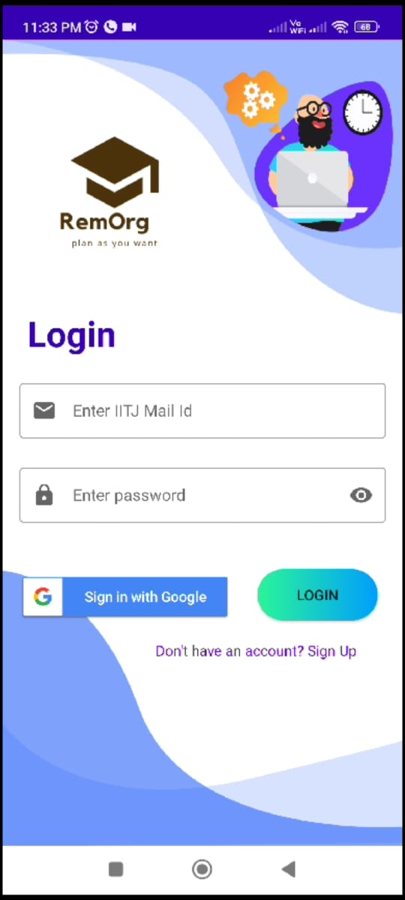

# 📚 Remorg_Apk - Your Ultimate IITJ Online Class Companion

Remorg_Apk is a specially designed application tailored to meet the needs of IITJ students, enhancing the online learning experience. This app offers a range of features to simplify and streamline your virtual classes.

### 📹[demoVideo](https://drive.google.com/file/d/1yz5U1xI9nkMPjSdMjaUc3kJJ4RwdfnX6/view?usp=sharing)

## 🚀 Features

### 🔒 Login Screen
Remorg_Apk provides a secure login screen that offers two options:
- **Local Database (MySQL):** Store your login data securely on your device.
- **Firebase Authentication:** Seamlessly sign in using your Google account.

### ⏰ Reminder
*Coming Soon* - We're currently working on adding a reminder feature to help you stay organized and never miss a class.

### 📧 Mail Integration
Easily connect to your email app directly from Remorg_Apk with a single tap. Stay updated and never miss important communications from your instructors.

### 📅 Organizer
The Organizer feature is your go-to tool for keeping track of your classes:
- **Meet Links:** Store and access all your class meeting links in one place.
- **Class Schedule:** See the time of each class, and join meetings directly from the app.

### 📖 Study Guide
Access your study materials effortlessly with the Study Guide feature:
- **Subject-wise Resources:** Find study materials for each subject conveniently organized.
- **Google Drive Integration:** All your study materials are stored and accessible on Google Drive.

## 📝 How to Use

1. **Login:** Choose your preferred login method - local database or Firebase authentication.
2. **Explore Features:** Navigate through the app to access reminders, mail, organizer, and study materials.
3. **Stay Organized:** Use the Organizer to manage your class schedule and meet links.
4. **Access Study Materials:** Dive into the Study Guide to access study materials for all your subjects.

---

*Note: This README is a work in progress and will be updated as new features and improvements are made to Remorg_Apk.*
